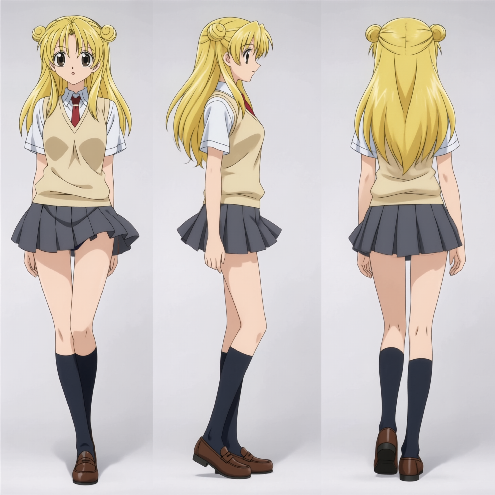

# H3 Character Sheet Creator Workflow

얼굴 참조 이미지와 의상 참조 이미지를 넣으면 **3-뷰(정면/측면/후면) 캐릭터 시트**를 만들어 주는 ComfyUI 워크플로우입니다. MiniMax-H3 Ref2VA 기반.

## 결과 예시

| 얼굴 참조 | 의상 참조 |
|:---:|:---:|
|  |  |

⬇️



얼굴 참조에서 **인물 정체성(이목구비·헤어)** 을, 의상 참조에서 **옷만** 가져와 하나의 캐릭터로 합성합니다.

## 파일

| 파일 | 설명 |
|---|---|
| `260901_H3_character_sheet(sain2d_modfied)_KOR.json` | 워크플로우 (한글 UI) |
| `260901_H3_character_sheet(sain2d_modfied)_ENG.json` | 워크플로우 (영문 UI) |
| `asset/` | 예시 참조 이미지 및 결과물 |

## 동작 방식

**Stage 1 — 3-뷰 시트 생성**
- 얼굴 이미지 → `SAM3Segment`로 머리만 추출
- 의상 이미지 → `ClothesSegment`(SegFormer)로 옷만 추출 (얼굴 자동 제거)
- 두 참조를 H3에 물려 정면/측면/후면 3-뷰 시트 출력

**Stage 2 — 포즈 전개 (선택)**
- Stage 1 결과 + 포즈 참조로 1~4 패널 생성
- 선택 입력: 소품/무기, 배경/환경, 추가 액세서리

## 필요 모델

```
UNET   minimax_h3_ref2va_pruned_int8_convrot.safetensors
CLIP   qwen3vl_32b_minimax_h3_int8_convrot.safetensors
       gemma4_e4b_it_fp8_scaled.safetensors
VAE    minimax_h3_t1_image_vae_step1597.safetensors
       minimax_h3_audio_vae_fp32.safetensors
LoRA   h3-realism-people-t2v-i2v-r2v  (trigger: r34l1sm)
Accel  MiniMax-H3-Ref2VA-Acc-8Step.safetensors
```

커스텀 노드: SAM3Segment, ClothesSegment(SegFormer), rgthree, Toobusy H3 노드팩

## 사용법

1. ComfyUI에 JSON을 드래그해서 로드
2. `Stage 1 REQUIRED 1` 에 얼굴 이미지, `Stage 1 REQUIRED 2` 에 의상 이미지 업로드
3. 실행 → `output/charsheet/` 에 3-뷰 시트 저장
